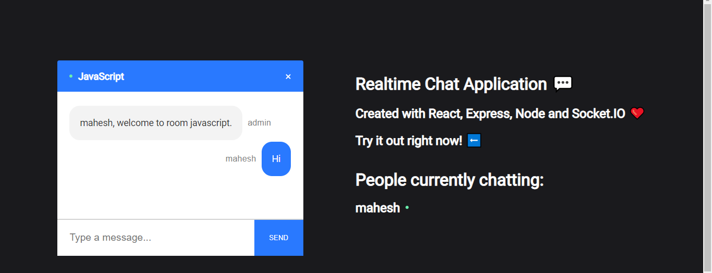
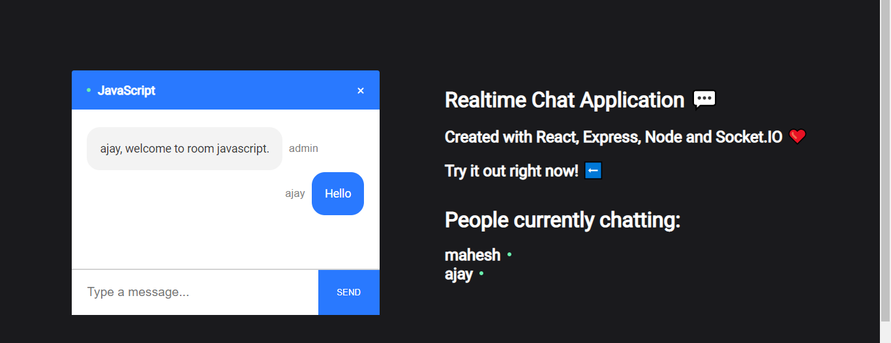
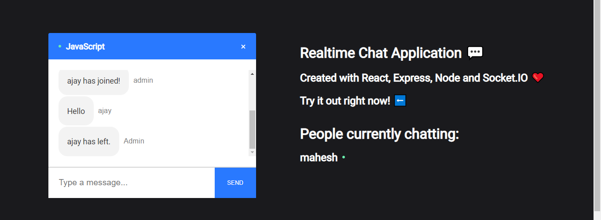

# :rocket: Chat App

Building a full Realtime Chat Application.

## :arrow_right: Technologies Used:

:one: Node

:two: Express

:three: React

:four: Socket.IO

## :arrow_right: Get Started

Clone the repository

`git clone https://github.com/maheshkhatana/Chat-App.git`

In the project directory(Chat-App/Client)

`npm install`

In the project directory(Chat-App/Server)

`npm install`

To run the application, In the project directory(Chat-App/Client)

`npm start`

To run the application, In the project directory(Chat-App/Server)

`node index`

## :arrow_right: Demo

##### Create Room

##### Start Chat

